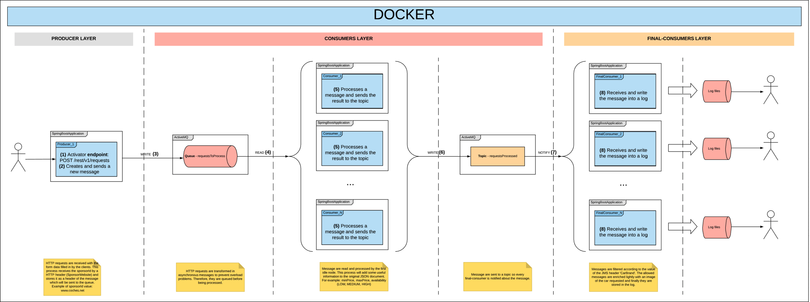
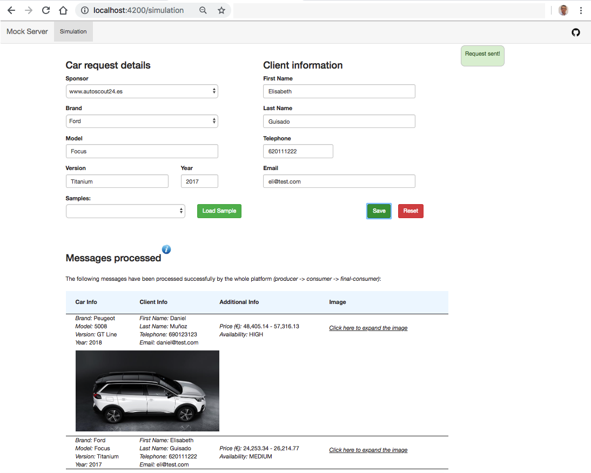

# Proof of concept of the integration of Docker, Docker Compose, Apache Camel and Apache ActiveMQ. 
The purpose of this project is to create a sample project which can be used as a useful guide to create **predefined** and **customised Apache Camel components** in a **Spring Boot application**.
Therefore, throughout this project you will find samples of the following Camel stuff:

* [Routes](http://camel.apache.org/routes.html)
* [Processors](http://camel.apache.org/processor.html)
* [Handlers](https://camel.apache.org/maven/current/camel-core/apidocs/org/apache/camel/Handler.html)
* [Type Converter](http://camel.apache.org/type-converter.html)
* [Message Filter](http://camel.apache.org/message-filter.html)
* [JsonPath](http://camel.apache.org/jsonpath.html)
* [Content Based Router](http://camel.apache.org/content-based-router.html)
* [ActiveMQ component](http://camel.apache.org/activemq.html)
* [Restlet component](http://camel.apache.org/restlet.html)
* [Custom components](http://camel.apache.org/writing-components.html)

Aside from that, the communication between the three modules implemented throughout this project is always asynchronous and is based on messaging.
Both queues and topics are used in the Spring Boot applications contained in this project.

# Architecture Overview

All the applications have been configured by **Docker-compose**, so the whole environment can be tested easily.
This configuration uses both local and remote images located in a [Docker Hub](https://hub.docker.com/).



# Modules
The design to be implemented is explained in the following sections. The intention is not to show all the details required as it will only be used to determine an overview of the entire architecture.
That being said, let's explain the four components which the architecture is based on.

## [Angular 6 application](https://github.com/dmunozr/docker-camel-activemq/tree/master/mock-server)
In order to make the use of this platform easier, an Angular 6 application has been created so the whole functionality can be tested quickly.
As summary, throughout this small application you will find samples of the following Angular stuff:

* Routing
* Components
* Reactive Forms
* Reactive Forms Validators
* Services
* HTTP requests by RxJs
* HTTP interceptors
* HTTP Error Handling
* Application Storage
* Actions
* Reducers
* Effects
* Angular Material (table)

What this application does is basically to send HTTP requests to an endpoint of the component 'Producer', which is the entry point of the whole execution process.
The following screenshot shows how this small Angular application looks like:



As you can see in this screenshot, you can create requests by filling in the information related to the car and the client.
Also, the system allows the user to reuse some preloaded requests instead of filling in all the required information.
To do that, the user must select one of the available samples in the select 'Samples' and after clicking the button 'Load Sample' all the form fields will get filled in automatically.
At this point, the button 'Save' is enabled just when all the mandatory information has been filled in correctly.
After clicking this button, the request is sent to the platform so it is processed. To ensure that the requests are processed as expected, this UI also shows a table containing all the messages which have been processed by all the components of the platform: producer, consumer and final-consumer.

Bear in mind that, by default, only the requests containing the brand 'Peugeot' and 'Ford' are processed by the component 'Final-Consumer'. Therefore, only these messages will appear in the table since the other brands are not processed by any 'Final-Consumer'. Don't freak out, you will get more information about this configuration in the next sections.

## [JMeter test](https://github.com/dmunozr/docker-camel-activemq/tree/master/load-tests)
In case of you want to test the performance of this platform, you can use this test suite to make lots of HTTP requests easier, which will be the entry point of the whole process.
The JMeter suite includes just one test which is basically an HTTP POST sample like this:

    POST http://localhost:8080/rest/v1/requests
    
    Content-Type: application/json
    SponsorWebsite: www.coches.net
    
    {
        "requests": [{
                "car": {
                    "brand": "Peugeot",
                    "model": "5008",
                    "version": "GT Line",
                    "year": "2017"
                },
                "client": {
                    "firstName": "Daniel",
                    "lastName": "Muñoz Rivas",
                    "telephone": "690525252",
                    "email": "daniel@gmail.com"
                }
            },
            {
                "car": {
                    "brand": "Ford",
                    "model": "Focus",
                    "version": "Inspire",
                    "year": "2012"
                },
                "client": {
                    "firstName": "Maria",
                    "lastName": "Moreno Reina",
                    "telephone": "610111111",
                    "email": "maria@gmail.com"
                }
            }
        ]
    }

NOTE: As you can see, the HTTP content will be a JSON containing some information about a client interested in a specific car. 
The identifier of the sponsor Website where the request was originated must be included as an HTTP header.

## [Producer](https://github.com/dmunozr/docker-camel-activemq/tree/master/producer)
It is a Spring Boot application whose main goal is to receive the HTTP requests sent by the aforementioned JMeter.
The rest controller is based on the Camel component [Restlet](http://camel.apache.org/restlet.html).
At this point, the HTTP content is validated and transformed into a Java object of the class [CarBudgetsRequest.java](https://github.com/dmunozr/docker-camel-activemq/blob/master/model/src/main/java/com/demo/dto/CarBudgetsRequest.java) through Jackson.
Here we will apply the enterprise integration pattern [Content Based Router](http://camel.apache.org/content-based-router.html) to determine if the request is valid or not according to the presence of the header *'SponsorWebsite'*.
If the HTTP request is valid, then a message is sent to a **queue** of ActiveMQ named **'requestsToProcess'**. For example:

    {
        "requests": [{
            "car": {
                "brand": "Peugeot",
                "model": "5008",
                "version": "GT Line",
                "year": 2017
            },
            "client": {
                "firstName": "Daniel",
                "lastName": "Muñoz Rivas",
                "telephone": "690525252",
                "email": "daniel@gmail.com"
            }
        }, {
            "car": {
                "brand": "Ford",
                "model": "Focus",
                "version": "Inspire",
                "year": 2012
            },
            "client": {
                "firstName": "Maria",
                "lastName": "Moreno Reina",
                "telephone": "610111111",
                "email": "maria@gmail.com"
            }
        }]
    }

The messages are sent to the queue using the [ActiveMQ component](http://camel.apache.org/activemq.html). 
This component must be configured previously by using the Spring XML context file. This configuration has been included at [here](https://github.com/dmunozr/docker-camel-activemq/blob/master/producer/src/main/resources/applicationContext.xml). 

## [Consumer](https://github.com/dmunozr/docker-camel-activemq/tree/master/consumer)
It is another Spring Boot application which reads, processes the messages from an ActiveMQ queue, and then sends the messages to the **topic 'requestProcessed'**.
The messages are retrieved from the **queue 'requestToProcess'** using the [ActiveMQ component](http://camel.apache.org/activemq.html).
To process a message, the first step is splitting up the original message to get individual car budget requests. After that, we get a JSON like this:

    {
        "car": {
            "brand": "Peugeot",
            "model": "5008",
            "version": "GT Line",
            "year": 2017
        },
        "client": {
            "firstName": "Daniel",
            "lastName": "Muñoz Rivas",
            "telephone": "690525252",
            "email": "daniel@gmail.com"
        }
    }

The splitting up of the original message into different JSON pieces has been implemented using the [JsonPath](http://camel.apache.org/jsonpath.html) utility which is available as of Camel 2.13.
At this point, the next step is to unmarshal the JSON (plain text) into a Java object of the class [CarBudgetRequest.java](https://github.com/dmunozr/docker-camel-activemq/blob/master/model/src/main/java/com/demo/dto/CarBudgetRequest.java). This is implemented by defining a [custom type converter](http://camel.apache.org/type-converter.html), which is [JSONToCarBudgetRequestTypeConverter.java](https://github.com/dmunozr/docker-camel-activemq/blob/master/consumer/src/main/java/com/demo/camel/converter/JSONToCarBudgetRequestTypeConverter.java).
By using a [Camel route](http://camel.apache.org/routes.html) and a [Camel handler](https://camel.apache.org/maven/current/camel-core/apidocs/org/apache/camel/Handler.html), the budget request is enriched so it also contains the minimum and maximum price, and the availability of that model car as well.
[This enricher](https://github.com/dmunozr/docker-camel-activemq/blob/master/consumer/src/main/java/com/demo/camel/handle/EnrichCarBudgetRequestHandler.java) also extracts the value of the header 'SponsorWebsite' and includes it as part of the JSON stored in the message body. 
Therefore, two new nodes are added to the input JSON: *transactionInfo* and *additionalInfo*.

    {
        "transactionInfo": {
            "sponsorId": "www.coches.net"
        },
        "additionalInfo": {
            "minPrice": 20452.324,
            "maxPrice": 27133.469,
            "availability": "LOW"
        },
        "car": {
            "brand": "Peugeot",
            "model": "5008",
            "version": "GT Line",
            "year": 2017
        },
        "client": {
            "firstName": "Daniel",
            "lastName": "Muñoz Rivas",
            "telephone": "690525252",
            "email": "daniel@gmail.com"
        }
    }

Aside from this update, the handler [EnrichHandleCarBudgetRequestHandler.java](https://github.com/dmunozr/docker-camel-activemq/blob/master/consumer/src/main/java/com/demo/camel/handle/EnrichHandleCarBudgetRequestHandler.java) adds a new header **'CarBrand'** to the message, which contains the brand of the car.
This header will be used in the next steps to filter the messages retrieved from the **topic 'requestsProcessed'**. Finally, the message is sent to the topic.

## [Final-Consumer](https://github.com/dmunozr/docker-camel-activemq/tree/master/final-consumer)
This is the last of our Spring Boot applications. It processes and logs the messages coming in from the **topic 'requestsProcessed'**. 
Although initially all the messages are processed, they are filtered by their car brand (*header just injected by the consumer application* before sending the message to the topic). This means that only the messages related to the desired brands will be processed (i.e.: "Peugeot"). So, the messages related to a non-allowed car brand are rejected.
This behaviour is implemented by [CarBrandFilter.java](https://github.com/dmunozr/docker-camel-activemq/blob/master/final-consumer/src/main/java/com/demo/camel/filter/CarBrandFilter.java) which is a [custom Camel Filter](http://camel.apache.org/message-filter.html).
After filtering, we execute [AddCarInformationAsHeaderProcessor.java](https://github.com/dmunozr/docker-camel-activemq/blob/master/final-consumer/src/main/java/com/demo/camel/processor/AddCarInformationAsHeaderProcessor.java) which is a [custom Camel Processor](http://camel.apache.org/processor.html).
It processes the message to extract the brand, model and version from the input message, and saves them as a Camel Message Header. For example, the result of processing the above JSON would be:

        ...
        "car": {
            "brand": "Peugeot",
            "model": "5008",
            "version": "GT Line",
            "year": 2017
        },
        ...

        Header:
            imgFinderQuery = "Peugeot 5008 GT Line"

The next step is to invoke [ImgFinderComponent.java](https://github.com/dmunozr/docker-camel-activemq/blob/master/final-consumer/src/main/java/com/demo/camel/component/ImgFinderComponent.java) which is a [custom Camel Component](http://camel.apache.org/writing-components.html).
For further details, take a look at the Java classes appearing in the package [com.demo.camel.component](https://github.com/dmunozr/docker-camel-activemq/tree/master/final-consumer/src/main/java/com/demo/camel/component)
This component is invoked the same as a [predefined Camel component](http://camel.apache.org/components.html):

    to("imgfinder:search?headerContainingQuery=imgFinderQuery");

The purpose of our **custom Camel component "ImgFinder"** is to execute a search on Dogpile Website (http://www.dogpile.com/) and retrieve the first image returned in the HTTP response.
For example, it extracts the search query string from the header whose name is received as the parameter **"headerContainingQuery"**. In our case, this header is "imgFinderQuery".
Therefore, the component reads the value of that header and then it will invoke the following URL:

    http://results.dogpile.com/serp?qc=images&q=Peugeot%205008%20GT%20Line

The component executes the search by a utility class [WebSearchUtil.java](https://github.com/dmunozr/docker-camel-activemq/blob/master/final-consumer/src/main/java/com/demo/util/WebSearchUtil.java). 
It parses the HTTP response, extracts the first image URL and stores it as a new **header named "imgFinderResult"**.
According to the route [ProcessRequestsProcessedAndLogThemRoute.java](https://github.com/dmunozr/docker-camel-activemq/blob/master/final-consumer/src/main/java/com/demo/camel/route/ProcessRequestsProcessedAndLogThemRoute.java), the next step is to inject that image URL in the JSON.
To achieve this, we have implemented [InjectImageUrlProcessor.java](https://github.com/dmunozr/docker-camel-activemq/blob/master/final-consumer/src/main/java/com/demo/camel/processor/InjectImageUrlProcessor.java) which is another [custom Camel Processor](http://camel.apache.org/processor.html)
So, the JSON will contain an image of the car that we are looking for. Let's look at an example:

        "car": {
            "year": 2017,
            "imageUrl": "http://media.peugeot.co.uk/image/41/6/5008-suv-gt-line-exterior-reason-to-choose.107416.27.jpg?autocrop=1",
            "model": "5008",
            "brand": "Peugeot",
            "version": "GT Line"
        },

At this point, we are done. We finish the process writing the message into the log:
    
    {
        "car": {
            "year": 2017,
            "imageUrl": "http:\/\/media.peugeot.co.uk\/image\/41\/6\/5008-suv-gt-line-exterior-reason-to-choose.107416.27.jpg?autocrop=1",
            "model": "5008",
            "brand": "Peugeot",
            "version": "GT Line"
        },
        "additionalInfo": {
            "minPrice": 20452.324,
            "maxPrice": 27133.469,
            "availability": "LOW"
        },
        "client": {
            "firstName": "Daniel",
            "lastName": "Muñoz Rivas",
            "telephone": "690525252",
            "email": "daniel@gmail.com"
        },
        "transactionInfo": {
            "sponsorId": "www.coches.net"
        }
    }

Once a message has been processed successfully, it must be stored temporarily until it is retrieved by someone.
To achieve this feature, we have defined a couple of new Java classes:
* A singleton which stores the messages: [InMemoryMessageStorage.java](https://github.com/dmunozr/docker-camel-activemq/blob/master/final-consumer/src/main/java/com/demo/storage/InMemoryMessageStorage.java) 
* A new camel route which uses Restlet to offer an endpoint to retrieve the messages: [PublishProcessedMessagesRoute.java](https://github.com/dmunozr/docker-camel-activemq/blob/master/final-consumer/src/main/java/com/demo/camel/route/PublishProcessedMessagesRoute.java)
* A new camel route which retrieves the messages and clean the temporary message storage: [RetrieveMessagesAndPurgeInMemoryStorageRoute.java](https://github.com/dmunozr/docker-camel-activemq/blob/master/final-consumer/src/main/java/com/demo/camel/route/RetrieveMessagesAndPurgeInMemoryStorageRoute.java)

That's said, the new endpoint (http://localhost:8082/rest/v1/messages) returns an HTTP response like this one:

    {
        "messages": [{
            "car": {
                "year": 2018,
                "imageUrl": "http://media.peugeot.co.uk/image/41/6/5008-suv-gt-line-exterior-reason-to-choose.107416.27.jpg?autocrop=1",
                "model": "5008",
                "brand": "Peugeot",
                "version": "GT Line"
            },
            "additionalInfo": {
                "minPrice": 45466.445,
                "maxPrice": 53908.97,
                "availability": "HIGH"
            },
            "client": {
                "firstName": "Daniel",
                "lastName": "Muñoz",
                "telephone": "690123123",
                "email": "daniel@test.com"
            },
            "transactionInfo": {
                "sponsorId": "www.autocasion.com"
            }
        }]
    }

# How to start up the environment using Docker

Clone the repository in your local machine and execute the following command from the main directory:

    ./docker-run.sh build_start
    
This command will start up an instance of each container:
* Client (Angular 6 application)
* ActiveMQ
* Producer Spring Boot application
* Consumer Spring Boot application
* Final-Consumer Spring Boot application
    * Configured to listen messages containing the make "Peugeot" or "Ford"

Once started up, you can access to the [Client UI](http:localhost:4200) 
You can also invoke the entry endpoint easily by using the JMeter test suite [load-test](https://github.com/dmunozr/docker-camel-activemq/blob/master/load-tests/src/test/jmeter/loadTests.jmx).

## Clustering

If you prefer to test the applications under a cluster environment, you can test it by executing the following command instead:

    ./docker-run.sh cluster_build_start

This command ends up using another docker-compose configuration ([docker-cluster-compose.yml](https://github.com/dmunozr/docker-camel-activemq/blob/master/docker-cluster-compose.yml)), which defines:
* 1 instance of the Angular 6 application
* 1 instance of the ActiveMQ
* 1 instance of the Producer Spring Boot application
* 2 instances of the Consumer Spring Boot application
* 2 instances of the Final-Consumer Spring Boot application
    * One of them is configured to listen to messages containing the make "Peugeot"
    * The other one listens to messages containing the make "Ford"

# How to deploy my own docker image into Docker Hub so it can be used from out of this project

The first step is to **start up the container**. Watch out, the image will be created from the current configuration of the container.
Then we need to get the **containerId**, so:
```
$ docker container ls
CONTAINER ID        IMAGE                       COMMAND                  CREATED                  STATUS              PORTS
c8cda0022aea        producer                    "java -Djava.securit…"   Less than a second ago   Up 9 seconds        0.0.0.0:5005->5005/tcp, 0.0.0.0:8080->8080/tcp
...
```    
Now we are going to take an image from our current container. To achieve this, we need to **create a commit with the current container status**.
```
$ docker commit --author='DanielMR' --message='Spring Boot Application - Producer' c8cda0022aea camel-activemq-producer
```
Once the image is created we can check it by listing all the images:
```
$ docker image ls
```
The next step is to **create a tag** from this commit:
```
$ docker tag camel-activemq-producer dmunozr/camel-activemq-producer:1.0.0
```
Let's check if our tag was created successfully:
```
Daniels-MacBook-Pro:docker-camel-activemq drivas$ docker image ls
REPOSITORY                                                                              TAG                        IMAGE ID            CREATED              SIZE
dmunozr/camel-activemq-producer                                                         1.0.0                     d7a2a9c7ce6b        44 seconds ago       133MB
...
```
At this point, before pushing our docker image, we need to **log in in Docker Hub platform**:
```
$ docker login
Login with your Docker ID to push and pull images from Docker Hub. If you don't have a Docker ID, head over to https://hub.docker.com to create one.
Username: dmunozr
Password:
Login Succeeded
```
Almost done! We need to **push our tag to Docker Hub**:
```
$ docker push dmunozr/camel-activemq-producer:1.0.0
```
After this deployment, a configuration update of the component **producer** must be done:

      producer:
        container_name: producer
        image: dmunozr/camel-activemq-producer:1.0.0
        ports:
          - "8080:8080"
          - "5005:5005"
        depends_on:
          activemq:
            condition: service_started

# How to enable CORS in an Spring Boot application
Due to we are invoking one of our Spring Boot application ('Producer' container) from another of our containers ('Client'), we need to enable the CORS so we don't get any error while invoking the endpoint.
At this point, there are different ways to enable CORS in a Spring Boot application. First, I tried to do it by using annotations directly, however I faced a lot of problems since I am using the Camel component 'Restlet' in our application 'Producer'.
So finally, I configured it through a new HTTP filter [CORSFilter](https://github.com/dmunozr/docker-camel-activemq/blob/master/final-consumer/src/main/java/com/demo/security/CORSFilter.java) so HTTP request containing the origin 'http://localhost:4200' are allowed.

That's all!
